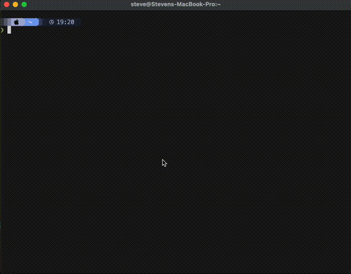

# Time Tracking CLI

A command-line utility for tracking and analyzing your work time with support for multiple output formats. This tool creates daily time tracking files, opens them in your default editor, and then parses the data to provide detailed summaries.



## Main uses cases:

- Quickly track time throughout your day. Just run `ttcli` which will open today's file in the editor defined by your `$EDITOR` environment variable. After saving/exiting, you'll see a summary of your tracked time.
- See a summary of your tracked time for a specific day without launching the editor by running `ttcli --noedit YYYY-MM-DD` such as `ttcli --noedit 2025-10-03`.
- Edit a previous day's time tracking by running `ttcli YYYY-MM-DD` such as `ttcli 2025-10-03`.
- See a summary of your tracked time in different formats (default, plain text, markdown) using the `--formatter` option. `ttcli --formatter markdown` is great for copying into reports or notes.
- See a weekly summary of your tracked time with `ttcli --week` (or `--week YYYY-MM-DD` for a specific week, where YYYY-MM-DD is a date within that week). Note that you can change which day the week starts on with the `--week-start` option (default is Monday).
- Use `ttcli --serve` to start a local web server that serves a web interface for viewing and editing your time tracking data. The web interface provides a more visual way to interact with your time tracking files. Note that you can specify a different port with `ttcli --serve --port 8080` to launch it on port 8080.
- Create a "template file" and configure the data directory if you want to have a predefined structure for your daily time tracking files. Create a file named `template.md` in the `~/.time-tracking/` directory, and it will be used as the starting point for new daily files. For instance, you could store your time tracking data within the directory for another note system, provided it can read markdown formats. (Obsidian for example, where you could use the Daily Note feature).
- Configure the interface with your configuration file. On Mac, this is typically located at `~/Library/Application Support/time-tracking-cli/config.toml`. On Linux, it's usually at `~/.config/time-tracking-cli/config.toml`. You can customize settings like the data directory, default editor, and more. If the file doesn't exist, it will be created with default settings when you first run `ttcli`.

## Optional neovim configuration

- You can set this up to get neovim previews by copying the files into your neovim setup like so:

```
mkdir -p ~/.config/nvim/lua/custom/timetracking
cp neovim/init.lua ~/.config/nvim/lua/custom/timetracking/
cp neovim/timetracking.lua ~/.config/nvim/lua/plugins/
```

Configure the folder in the timetracking.lua file to match where you store your time tracking files.

When you edit a file through the command or the TUI, it will automatically render the live preview with this configuration.

Note: I'm a n00b when it comes to lua and neovim plugins, so eventually I'll clean this up and make it an official neovim plugin.

### Example configuration

```toml
week_start_day = "Saturday"
data_directory = "/Users/your.username/Documents/Daily Log"
template_file = "/Users/your.username/Documents/Templates/Daily Template.md"
```

## Installation

### From Releases

- Grab the latest from (Releases)[http://github.com/stevenwcarter/time-tracking-cli/releases] for your architecture
- Extract the file, which should just contain a single `ttcli` binary.
- Move the binary to a directory in your `$PATH`, such as `/usr/local/bin` or `~/bin`, ensuring the chosen directory is in your `$PATH`.

### Manual: Install with symlink setup

These commands will clone the repo, build the web assets, and compile/install the binary.

```bash
git clone <repo-url>
cd time-tracking-cli
bash install.sh
```

### Manual steps without symlink setup

```bash
# Clone and install
git clone <your-repo-url>
cd time-tracking-cli
cd site
yarn
yarn build
cd ..
# The previous steps build the web assets for the site accessible via `ttcli --serve`
cargo install --path .
```

This will install the full `ttcli` binary and website (available with --serve option)

## Usage

```bash
# These are equivalent:
ttcli --help

# Use today's date
ttcli

# Specify a date (positional argument)
ttcli 2025-10-03

# Specify a date (using flag)
ttcli --date 2025-10-03
```

## Output Formats

The CLI supports multiple output formats via the `--formatter` option:

```bash
# Default format (emoji-rich, colorful)
ttcli 2025-10-03

# Plain text format (no emoji)
ttcli --formatter plain 2025-10-03

# Markdown format
ttcli --formatter markdown 2025-10-03
```

### Format Examples

**Default format:**

```
📅 TIME OVERVIEW
⏱️  WORKING TIME
📋 PROJECTS
  📌 code1 - 5:00 (5.00 hrs)
```

**Plain format:**

```
TIME OVERVIEW
WORKING TIME
PROJECTS
  * code1 - 5:00 (5.00 hrs)
```

**Markdown format:**

```
**Total Time:** 8.25 hours
**Projects:**
  - **code1** - 5.00 hours
```

### How it works

1. **Directory Creation**: Creates `~/.time-tracking/` directory if it doesn't exist
2. **File Creation**: Creates or opens a `YYYY-MM-DD.md` file for the specified date
3. **Editor Launch**: Opens the file in your default `$EDITOR` (or `$VISUAL`)
4. **Parse & Display**: After you save and exit the editor, parses the time data and displays a summary

### Time Tracking Format

In the editor, enter your time tracking data using this format:

```
# Time Tracking - 2025-10-03

11:45-12:15 project_code1
- Comment about what you worked on
12:15-1:30 project_code2
- Another comment about your work
1:30-2 project_code1
- More work on the first project
2-4 project_code3
- Different project work
```

### Time Format

- **Time ranges**: Use 12-hour format (e.g., `11:45-12:15`, `2-4`, `2:30-3`). There's really no concept of "AM" or "PM" here; just use the times that make sense for your day.
- **Project codes**: Any alphanumeric identifier (e.g., `code1`, `client-bd`, `admin`)
- **Comments**: Lines following a time entry are treated as notes for that entry

### Features

- **Time Aggregation**: Time spent on the same project code is automatically summed up
- **Dead Time Detection**: Identifies gaps in your time tracking
- **Multiple Formats**: Supports various time formats (with/without minutes, 24-hour format)
- **Detailed Reports**: Shows start/end times, total working time, and per-project breakdowns

### Example Output

```
============================================================
TIME TRACKING SUMMARY
============================================================

📅 TIME OVERVIEW
Start Time: 11:45
End Time:   4:00

⏱️  WORKING TIME
Total: 4:15 (4.25 hours)

⏸️  DEAD TIME
✅ No dead time (gaps) found

📋 PROJECTS

  📌 project_code1 - 1:00 (1.00 hrs)
     • Comment about what you worked on
     • More work on the first project

  📌 project_code2 - 1:15 (1.25 hrs)
     • Another comment about your work

  📌 project_code3 - 2:00 (2.00 hrs)
     • Different project work
```

### Editor Configuration

The tool uses your system's default editor. You can configure it by setting environment variables:

```bash
export EDITOR=vim
export VISUAL=code
```

Common editors:

- `vim` or `nvim` for Vim/Neovim
- `code` for VS Code
- `nano` for a simple terminal editor
- `emacs` for Emacs

### Files Location

All time tracking files are stored in `~/.time-tracking/` with the naming convention `YYYY-MM-DD.md`.

## Dependencies

- `clap` - Command-line argument parsing
- `chrono` - Date/time handling
- `dirs` - Platform-agnostic directory access
- `time-tracking-parser` - Time parsing and aggregation logic

## License

This project uses the same license as the `time-tracking-parser` dependency.
